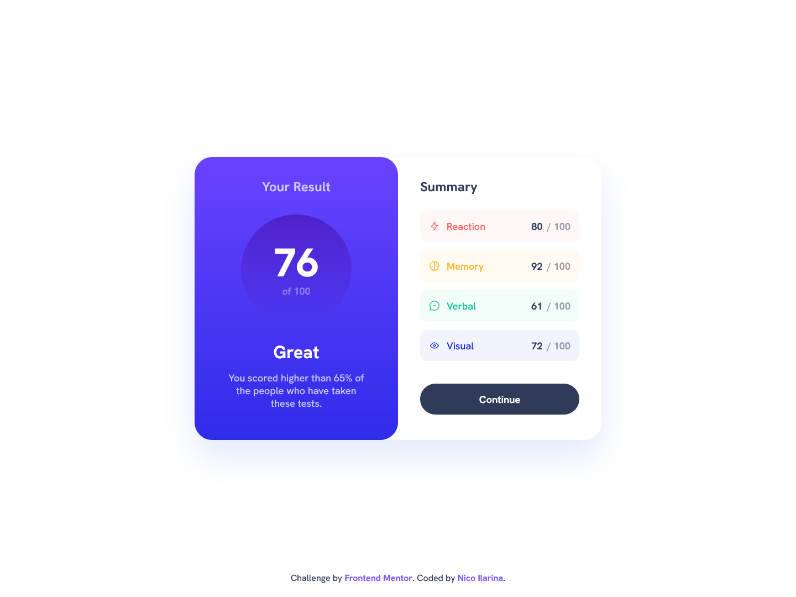

# Frontend Mentor - Results summary component solution

This is a solution to the [Results summary component challenge on Frontend Mentor](https://www.frontendmentor.io/challenges/results-summary-component-CE_K6s0maV). Frontend Mentor challenges help you improve your coding skills by building realistic projects.

## Table of contents

- [Frontend Mentor - Results summary component solution](#frontend-mentor---results-summary-component-solution)
  - [Table of contents](#table-of-contents)
  - [Overview](#overview)
    - [The challenge](#the-challenge)
    - [Screenshot](#screenshot)
    - [Links](#links)
  - [My process](#my-process)
    - [Built with](#built-with)
    - [Useful resources](#useful-resources)
  - [Author](#author)

**Note: Delete this note and update the table of contents based on what sections you keep.**

## Overview

### The challenge

Users should be able to:

- View the optimal layout for the interface depending on their device's screen size
- See hover and focus states for all interactive elements on the page

### Screenshot

**Note: Delete this note and the paragraphs above when you add your screenshot. If you prefer not to add a screenshot, feel free to remove this entire section.**

### Links

- Solution URL: [repo](https://github.com/nicodes-dev/fem-result-summary-component)
- Live Site URL: [live](https://result-summary-component-challenge.onrender.com/)

## My process

### Built with

- Semantic HTML5 markup
- CSS custom properties
- Flexbox
- CSS Grid
- Mobile-first workflow
- [Tailwindcss](https://tailwindcss.com/) - CSS framework

**Note: Delete this note and the content within this section and replace with your own plans for continued development.**

### Useful resources

- [transitioning gradients](https://keithjgrant.com/posts/2017/07/transitioning-gradients/) - Since there isn't a direct way of adding transitions on gradient backgrounds, this taught me a way of adding transition on my hover state.

**Note: Delete this note and replace the list above with resources that helped you during the challenge. These could come in handy for anyone viewing your solution or for yourself when you look back on this project in the future.**

## Author

- Frontend Mentor - [@nicodes-dev](https://www.frontendmentor.io/profile/nicodes-dev)
- Twitter - [@nicodesdev](https://twitter.com/nicodesdev)
